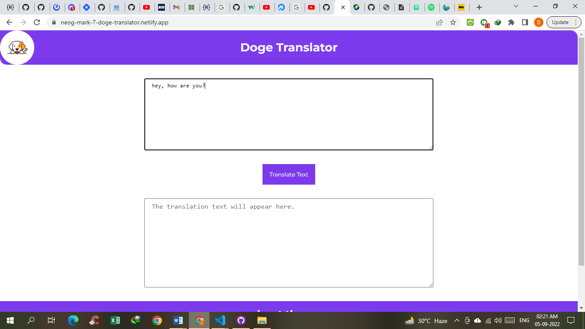
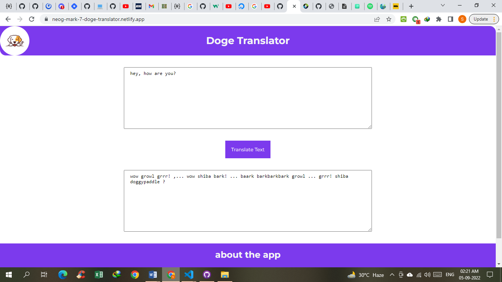

# Minion Translator 

A doge translator app made using HTML, CSS and JS. Uses [translation api](https://funtranslations.com/) to convert your input text to the minion language.

## How To Use:

Enter your text in the input text column and then click of the translate button.

The output, using the translation api call will appear as follows:

